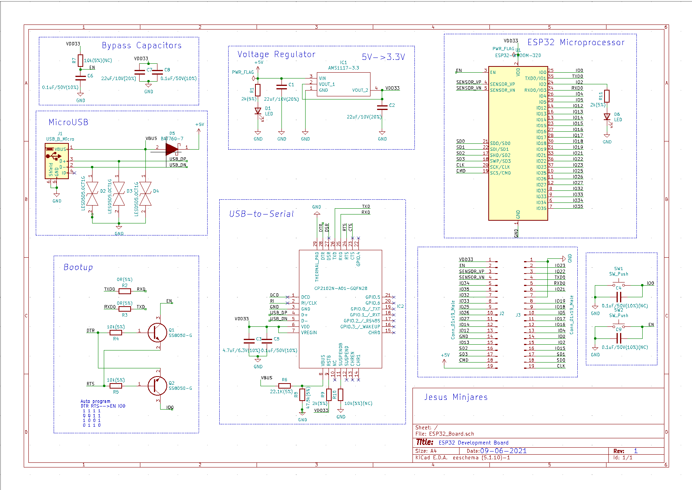

# ESP32 PCB Design

This repository contains the **PCB** and **schematic design** for a custom ESP32 development board.  
It showcases the **front view**, **back view**, and **schematic diagram** so you can visualize the complete design without downloading the files.

---

## 🖼 PCB & Schematic Previews

### Front View  

### Back View  

### Schematic Diagram  

---

## 📂 Project Structure
ESP32PCB/
├── ESP32 front.png
├── ESP32 back.png
├── sch_esp.png
└── README.md

---

## 🛠 Tools & Components Used
- **KiCad** – PCB & schematic design
- **ESP32-WROOM-32** – Main microcontroller module
- Passive & active components as per the schematic

---

## 🚀 How to Use This Project
1. Open the schematic and PCB layout in **KiCad**.
2. Review the connections and footprints.
3. Generate **Gerber files** for PCB fabrication.
4. Assemble the board according to the schematic.
5. Upload firmware to the ESP32 and test the board.

---

## 📜 License
This project is licensed under the **MIT License** – you are free to use, modify, and distribute it with attribution.

---

## 📧 Contact
**Author:** Bhargav Ram  
**GitHub:** [BhargavRamJosh](https://github.com/BhargavRamJosh)  
**Email:** bt22ece107@iiitn.ac.in
